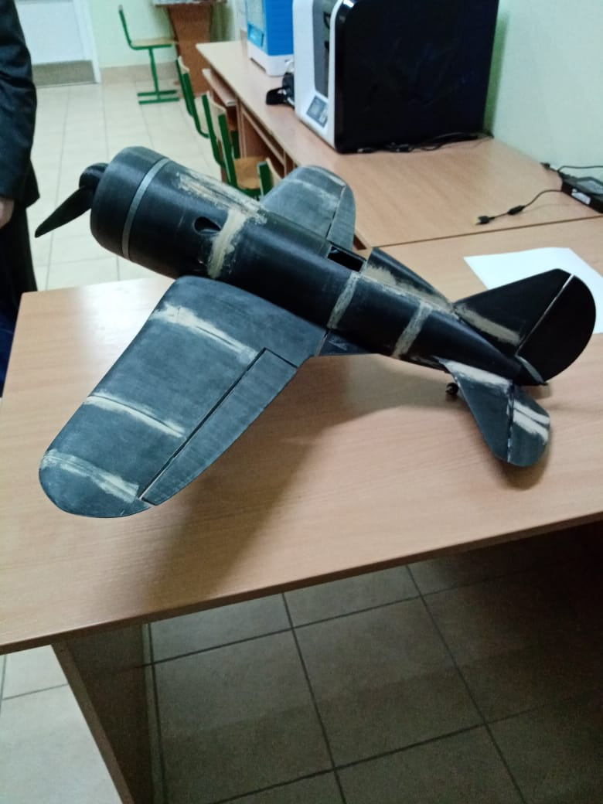
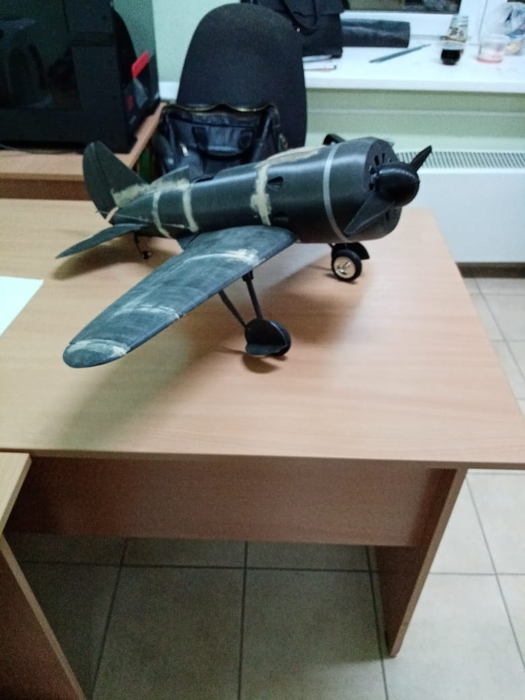

# Airplane Ino
Репозиторий был создан для проверки видимого результата в ходе работы над проектом: **"Самолёт И-16"**. Здесь будет размещаться основная, полезная информация, полученная в ходе работы. Часть из документационного файла может использоваться в пояснительной записке.

## Images
В папке **handbook** лежит справочная информация в виде картинок по плате *Strela* и программной части проекта.


**Вид самолёта слева.**


**Вид самолёта справа.**



## Arduino
Теперь перейдем к коду проекта, всем уловкам и подводным камням.
### Библиотеки Strela
Самые главные отличия лежат в основе работы с портами, контактами и пинами соответственно. Платформа *Strela* имеет на борту контакты подключённые к Arduino-микроконтроллеру и контакты подключённые к **I²C-расширителю** портов ввода-вывода. На аппаратном уровне доступ к этим портам ввода-вывода очень сильно различается, но библиотека *Strela* позволяет облегчить данную задачу. Разница в управлении контактами Arduino и контактами **I²C-расширителей** портов отсутствует, если использовать функции `uPinMode`, `uDigitalWrite` и `uDigitalRead`. Конечно, можно использовать и привычные функции управления цифровыми контактами, но они будут работать только с Arduino-контактами. Также просмотрев репозиторих на GitHub и командные файлы увидел, что были добавлены новые функции, в работу с Arduino, такие как: `drive`, `motorSpeed`, `motorConnection`, `stepperMotor`.

- **drive -** функция используется для работы с первым и одновременно вторым мотором, в качестве аргументов подаются числа от -255 до 255 => это их скорость.
- **motorSpeed -** как я понял, одна из дочерних функций `drive`, для корректного и правильного использования.
- **motorConnection -** функция используется для изменения направления мотора, для того чтобы их не пришлось перекручивать.
- **stepperMotor -** функция используется для работы с шаговым двигателем, при помощи этой функции мотор работает в полушагавом состоянии, что позволяет развивать наибольшую мощность двигателя, в качестве аргумента подаются числа, первое от -255 до 255 => это количество шагов, второе - это задержка.


Под условными константами S1, S2, S3, S4, да и вообще под всеми условными константами скрываются какие-то целочисленные значения, которые заменили для удобного использования.
```cpp
#define S1 50
#define S2 51
#define S3 52
#define S4 53
```


В остальном же все и так совместимо работает т.е. это основные и главный изменения, которые вносит разработанная библиотека, по крайней мере это все различия, которые я смог найти прочитав документацию к плате и просмотрев репозиторий на GitHub. 
### Библиотека Wire
Наиболее подходящая документация к использованию находится в ссылках. Данная библиотека позволяет нам связывать микроконтроллеры с устройствами и модулями через интерфейс **I²C** т.е. её задача находить эти самые расширители, а также находить устройства, подключенные через этот самый расширитель.
### Библиотека VarSpeedServo
Очень интересная библиотка, добавляющая огромное количество разных, интересных возможностей. Использовать же эти возможности можно, используя методы у родительского класса VarSpeedServo, подключенный из соответсвующей библиотеки. Весь функционал можно будет ощутить уже на практике и выявить непосрдственно самые крутые возможности, но с первого взгляда сразу же главное преймущество перед стандартной Servo-библиотекой - это возможность избавиться от плавностьобразующих циклов на совсем и вместо них вызывать метод **write** с выбраными для задачи аргументами.
### Подключение библиотек
Подключение вышеупомянутых библиотек происходит следующим способом:
```cpp
#include <Strela.h>
#include <Wire.h>
#include <VarSpeedServo.h>
```


### Примеры программ
Примеры всех программ, которые как-либо могу поспособствовать в разработке более сильного и оптимизированного кода лежат в папке **examples**. Самый сложные и непонятные алгоритмы я буду разбирать в отдельных текстовых файлах.


Пример #1 - [Считывает положение кнопки при нажатии и включаем светодиод с тем же номером что и кнопка](examples/example_1.md)
Пример #2 - []()

## Этапы работы

## Технические характеристики

## Использующие компоненты


## All links
- [Основной сайт с правочной информацией платы](http://wiki.amperka.ru/%D0%BF%D1%80%D0%BE%D0%B4%D1%83%D0%BA%D1%82%D1%8B:strela)
- [Русская справочная инофрмация по Arduino](http://arduino.ru/Reference)
- [Справочная информация по ШИМ](http://wiki.amperka.ru/%D0%BA%D0%BE%D0%BD%D1%81%D0%BF%D0%B5%D0%BA%D1%82-arduino:%D1%88%D0%B8%D0%BC)
- [Сенсоры с цифровым сигналом](http://wiki.amperka.ru/%D1%81%D0%B5%D0%BD%D1%81%D0%BE%D1%80%D1%8B:%D1%86%D0%B8%D1%84%D1%80%D0%BE%D0%B2%D1%8B%D0%B5)
- [Сенсоры с аналоговым сигналом](http://wiki.amperka.ru/%D1%81%D0%B5%D0%BD%D1%81%D0%BE%D1%80%D1%8B:%D0%B0%D0%BD%D0%B0%D0%BB%D0%BE%D0%B3%D0%BE%D0%B2%D1%8B%D0%B5)
- [Работа с сервоприводами](http://developer.alexanderklimov.ru/arduino/servo.php)
- [Основная библиотека Servo](https://www.arduino.cc/reference/en/libraries/servo/)
- [Основная информация по самолёту И-16](https://ru.wikipedia.org/wiki/%D0%98-16)
- [Эскиз самолёта И-16](https://commons.wikimedia.org/wiki/File:Polikarpov_I-16.svg?uselang=ru)
- [Библиотека VarSpeedServo для Arduino](https://github.com/netlabtoolkit/VarSpeedServo)
- [Полезный урок по Arduino](https://web-shpargalka.ru/arduino-vyvod-v-konsol.php)
- [Сборник видеоуроков по Arduino](https://www.youtube.com/watch?v=Db0rsnAbekI&list=PLleXqmo8pio1THWNZlx-py52KgafepaHf)
- [Этот же GitGub репозиторий](https://github.com/surpri6e/airplane_ino)
- [GitHub репозиторий библиотеки Strela](https://github.com/amperka/Strela/tree/master/Strela/Examples)
- [Библиотека Wire и её применение](https://all-arduino.ru/biblioteki-arduino/arduino-biblioteka-wire/)

## Участники проекта
- **NyBiKPOLOL** - Святослав.
- **GuDpOkSuMeTuLxUhOkSuL** - Александр.
- **surpri6e** - Данила.

## License
See [the LICENSE file](./LICENSE).

Regards *surpri6e*.


